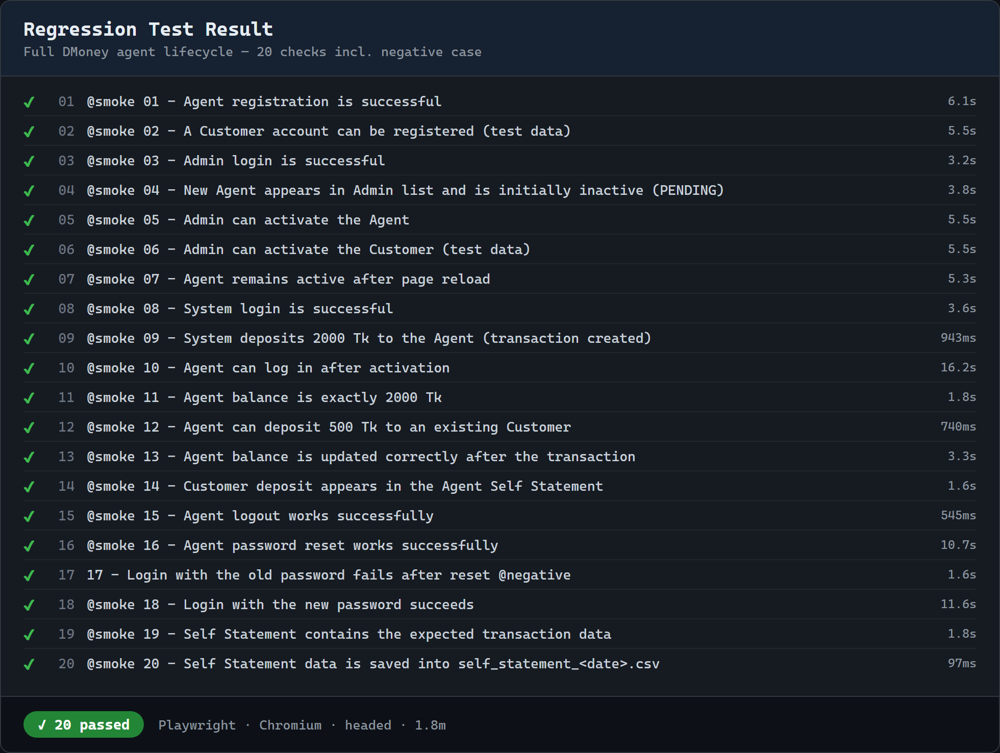
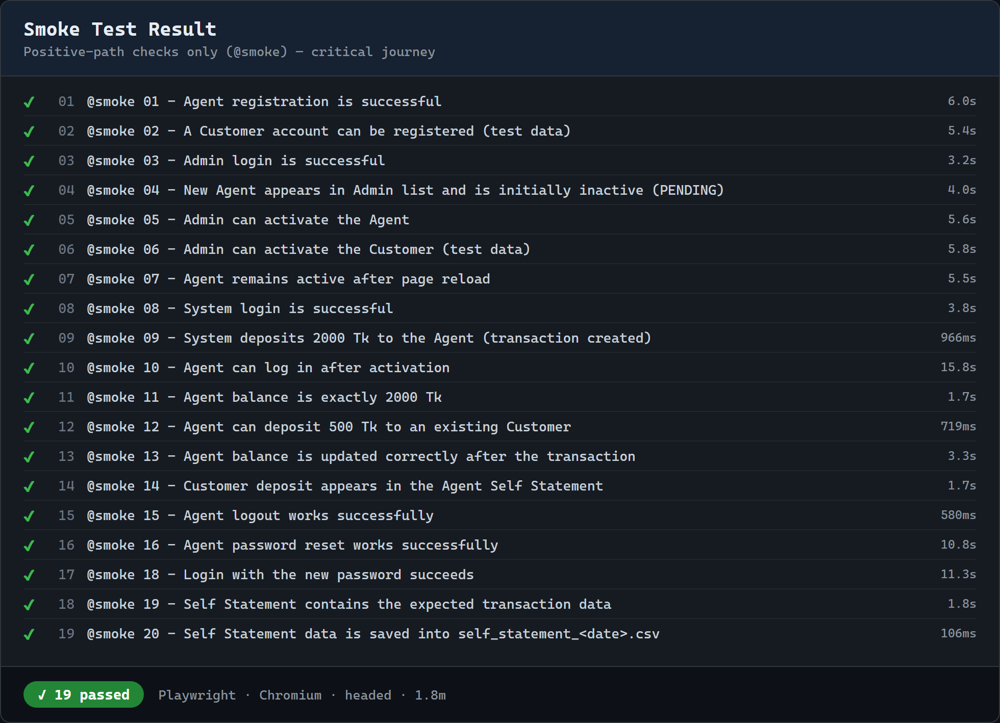

# DMoney Portal — Playwright End-to-End Automation

Automated end-to-end testing of the **DMoney** mobile-financial-service QA practice portal
([dmoneyportal.roadtocareer.net](https://dmoneyportal.roadtocareer.net)) using
[Playwright](https://playwright.dev/).

The suite drives the complete **Agent lifecycle** — registration, admin activation,
system funding, agent-to-customer transactions, logout, password reset, and statement
export to CSV — and verifies **20 assertions** end-to-end.

> **Road to Career — Batch 19 · Playwright Assignment**
> **Student ID:** ART61264

---

## Table of Contents

1. [Scenario](#scenario)
2. [Tech Stack](#tech-stack)
3. [Project Structure](#project-structure)
4. [Prerequisites](#prerequisites)
5. [Setup](#setup)
6. [How the Email-OTP Automation Works](#how-the-email-otp-automation-works)
7. [Running the Tests](#running-the-tests)
8. [Test Coverage](#test-coverage)
9. [Results](#results)
10. [Video Recordings](#video-recordings)
11. [CSV Export](#csv-export)
12. [Key QA Notes & Findings](#key-qa-notes--findings)

---

## Scenario

The automation completes this end-to-end journey:

1. Open the DMoney portal and register a new user with the **Agent** role.
2. Log in as **Admin** (`admin@dmoney.com`) and **activate** the new agent.
3. Log in as **System** (`system@dmoney.com`) and **deposit 2000 Tk** into the agent.
4. Log in as the **Agent** (OTP-protected) and verify the balance is **2000 Tk**.
5. **Deposit 500 Tk** from the agent to an existing **Customer** and verify success.
6. Log out, **reset the agent password**, confirm the **old password fails**, and log in
   with the **new password**.
7. Open **Self Statement**, extract the table, and save it to
   `self_statement_<today>.csv`.

---

## Tech Stack

| Concern              | Choice                                             |
| -------------------- | -------------------------------------------------- |
| Test runner          | `@playwright/test` (Chromium)                      |
| Language             | JavaScript (Node.js)                               |
| Email / OTP reading  | `imapflow` (Gmail IMAP)                            |
| Config / secrets     | `dotenv` + `.env` (git-ignored)                    |
| Reporting            | Playwright `list` + `html` reporters, video, trace |

---

## Project Structure

```
.
├── tests/
│   └── dmoney.e2e.spec.js     # The 20-step journey (describe.serial)
├── utils/
│   ├── helpers.js             # Page-object-style actions (register, login, activate…)
│   ├── mailbox.js             # Gmail IMAP: read login OTP & password-reset link
│   └── csv.js                 # Write the Self Statement to the required CSV
├── test-data/
│   └── self_statement_<date>.csv   # Generated export (sample committed)
├── screenshots/               # Result screenshots used in this README
├── videos/                    # Headed run recordings (regression + smoke)
├── playwright.config.js       # Headed by default; HEADLESS=1 for fast runs
├── .env.example               # Copy to .env and fill in
└── package.json               # npm scripts: regression / smoke / report
```

---

## Prerequisites

- **Node.js** 18+ and npm
- A **Gmail account** used to receive registration / OTP / reset emails, with a
  **Google App Password** (requires 2-Step Verification enabled).

---

## Setup

```bash
# 1. Install dependencies
npm install

# 2. Install the Chromium browser for Playwright
npx playwright install chromium

# 3. Create your .env from the template and fill in values
cp .env.example .env
```

Fill `.env`:

```ini
BASE_URL=https://dmoneyportal.roadtocareer.net
ADMIN_EMAIL=admin@dmoney.com
ADMIN_PASSWORD=1234
SYSTEM_EMAIL=system@dmoney.com
SYSTEM_PASSWORD=1234
GMAIL_USER=yourname@gmail.com
GMAIL_APP_PASSWORD=xxxx xxxx xxxx xxxx
```

**Getting a Gmail App Password:** Google Account → **Security** → enable **2-Step
Verification** → **App passwords** → create one (any name) → copy the 16-character code
into `GMAIL_APP_PASSWORD`. This is **not** your normal Gmail password, and `.env` is
git-ignored so it never reaches the repository.

---

## How the Email-OTP Automation Works

DMoney protects **agent login** with a 4-digit **OTP emailed** to the registered Gmail
address (admin/system accounts do not need it), and the **password reset** flow emails a
one-time link. There is **no fixed/bypass OTP**, so the suite reads the real emails:

- Registration emails use a unique **`+alias`** of `GMAIL_USER`
  (e.g. `yourname+agent1234567@gmail.com`), so every run is isolated while all mail lands
  in one inbox.
- `utils/mailbox.js` keeps a **single persistent IMAP connection**, issues an IMAP
  **`NOOP`** before each search to surface newly-arrived mail, and only accepts messages
  with a **UID greater than the baseline** captured just before the action — so a stale
  OTP from a previous run is never picked up.

---

## Running the Tests

```bash
# Full regression — headed (opens a real browser), records video
npm run regression

# Smoke suite — positive-path checks only (@smoke), headed
npm run smoke

# Fast headless run (any suite) — great for CI / quick checks
npm test                 # or: HEADLESS=1 npx playwright test

# Open the last HTML report
npm run report
```

> The agent OTP login is emailed, so a run spends a few seconds waiting for mail;
> timeouts are set generously to absorb delivery latency.

---

## Test Coverage

Every validation required by the assignment is covered by a dedicated, independently
reported test:

| #  | Required validation                                           | Test                                            |
| -- | ------------------------------------------------------------- | ----------------------------------------------- |
| 1  | Agent registration is successful                              | `01 - Agent registration is successful`         |
| 2  | New agent is initially **inactive**                           | `04 - … initially inactive (PENDING)`           |
| 3  | Admin login is successful                                     | `03 - Admin login is successful`                |
| 4  | Agent appears in the Admin user list                          | `04 - New Agent appears in Admin list …`        |
| 5  | Admin can activate the agent                                  | `05 - Admin can activate the Agent`             |
| 6  | Agent remains active after reload                             | `07 - Agent remains active after page reload`   |
| 7  | System login is successful                                    | `08 - System login is successful`               |
| 8  | System deposits 2000 Tk to the agent                          | `09 - System deposits 2000 Tk …`                |
| 9  | System deposit creates the correct transaction record         | `09 - … (transaction created)`                  |
| 10 | Agent can log in after activation                             | `10 - Agent can log in after activation`        |
| 11 | Agent balance is exactly 2000 Tk                              | `11 - Agent balance is exactly 2000 Tk`         |
| 12 | Agent can deposit 500 Tk to an existing customer              | `12 - Agent can deposit 500 Tk …`               |
| 13 | Agent balance updates correctly after the transaction         | `13 - Agent balance is updated correctly …`     |
| 14 | Customer deposit appears in the agent Self Statement          | `14 - Customer deposit appears in … Statement`  |
| 15 | Agent logout works                                            | `15 - Agent logout works successfully`          |
| 16 | Agent password reset works                                    | `16 - Agent password reset works successfully`  |
| 17 | Login with the **old** password **fails** after reset         | `17 - Login with the old password fails …`      |
| 18 | Login with the new password succeeds                          | `18 - Login with the new password succeeds`     |
| 19 | Self Statement contains the expected transaction data         | `19 - Self Statement contains … data`           |
| 20 | Self Statement data is saved into the required CSV file       | `20 - Self Statement data is saved …`           |

### Suites

- **Regression** (`npm run regression`) — all **20** tests, including the **negative**
  case (#17).
- **Smoke** (`npm run smoke`) — the **19** positive-path tests tagged `@smoke` (the
  negative case is excluded). Covers the critical happy path end-to-end.

---

## Results

### Regression Test Result

All 20 checks pass (headed, Chromium).



### Smoke Test Result

The positive-only smoke group (`@smoke`) — 19 checks pass.



---

## Video Recordings

Full headed runs are recorded under [`videos/`](videos/):

- `videos/regression-full-run.webm` — the complete 20-step journey.
- `videos/smoke-run.webm` — the positive-only smoke run.

> **Embedding on GitHub:** open this README on github.com in edit mode and **drag-and-drop**
> `videos/regression-full-run.webm` into the editor — GitHub hosts it and renders an inline
> player. (A repo-relative link to a `.webm` downloads rather than plays.)

---

## CSV Export

Test #20 extracts the entire Self Statement table and writes it to
`test-data/self_statement_<YYYY-MM-DD>.csv` (date-stamped as required, e.g.
`self_statement_2026-10-09.csv`).

Sample output:

```csv
Transaction ID,Sender Account,Receiver Account,Type,Debit,Credit,Balance,Date
TXNDS6SG3XXQW,SYSTEM,01885770080,Top-up from SYSTEM,-,2000.00,2000.00,"09/10/2026, 12:50:26"
TXNHE0KXHUAHF,01885770080,01685770080,Deposit Commission,500.00,12.50,1512.50,"09/10/2026, 12:50:47"
```

---

## Key QA Notes & Findings

- **Agent commission on cash-in.** When the agent deposits 500 Tk to a customer, the
  agent earns a **2.5% commission (12.50 Tk)**, so the resulting balance is
  `2000 − 500 + 12.50 = **1512.50**`, not 1500. Test #13 reads the commission from the
  statement and asserts the balance dynamically rather than hard-coding a value.
- **Agent login requires an emailed OTP**; admin and system logins do not.
- **Deterministic test data.** The suite registers and activates its **own** customer so
  the agent-to-customer deposit never depends on pre-existing data.
- **Clean role switching.** The whole journey runs in one browser context, switching
  roles via logout/login, which also yields a single continuous recording.
- **Secrets are safe.** `.env` (and `node_modules/`, `test-results/`,
  `playwright-report/`) are git-ignored; only `.env.example` is committed.
